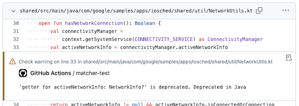

# Problem Matchers for Kotlin - Gradle

A GitHub Action to setup Problem Matchers for Kotlin compiler on Gradle.

## Usage

Just place this action step before Gradle commands.

```yaml
- uses: actions/checkout@v4
- uses: actions/setup-java@v4
  with:
    distribution: 'zulu'
    java-version: 17
- uses: yumemi-inc/problem-matchers/kotlin-gradle@v1
- run: ./gradlew ...
```

Then, the warning/error during compile will be displayed as an annotation in the Files changed tab and Job Summaries of the pull request.



## Limitations

See [problem-matchers.md](https://github.com/actions/toolkit/blob/main/docs/problem-matchers.md#limitations) in actions/toolkit.
